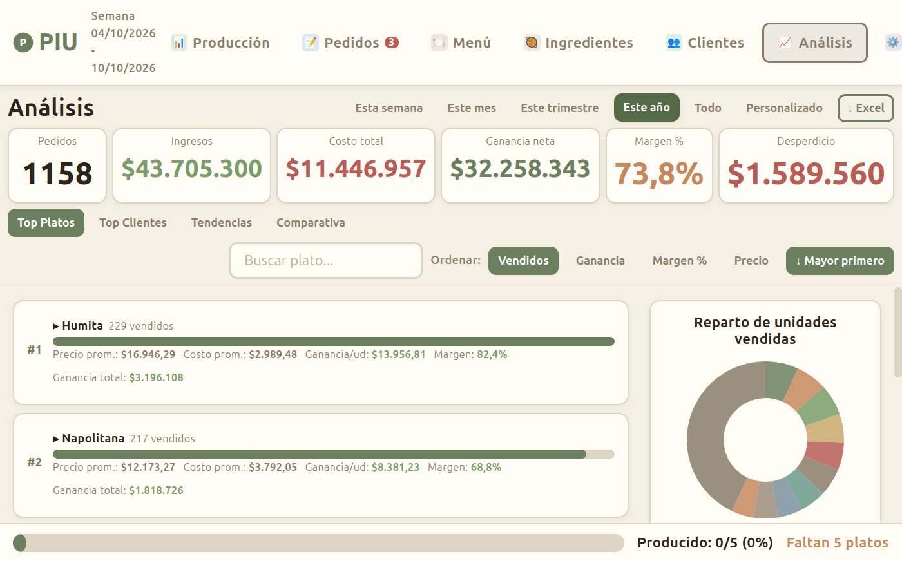
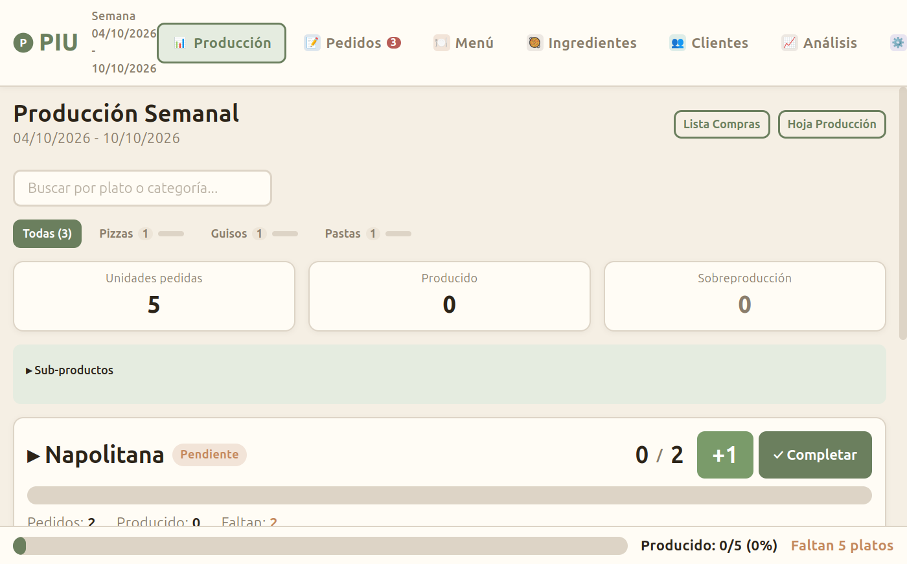
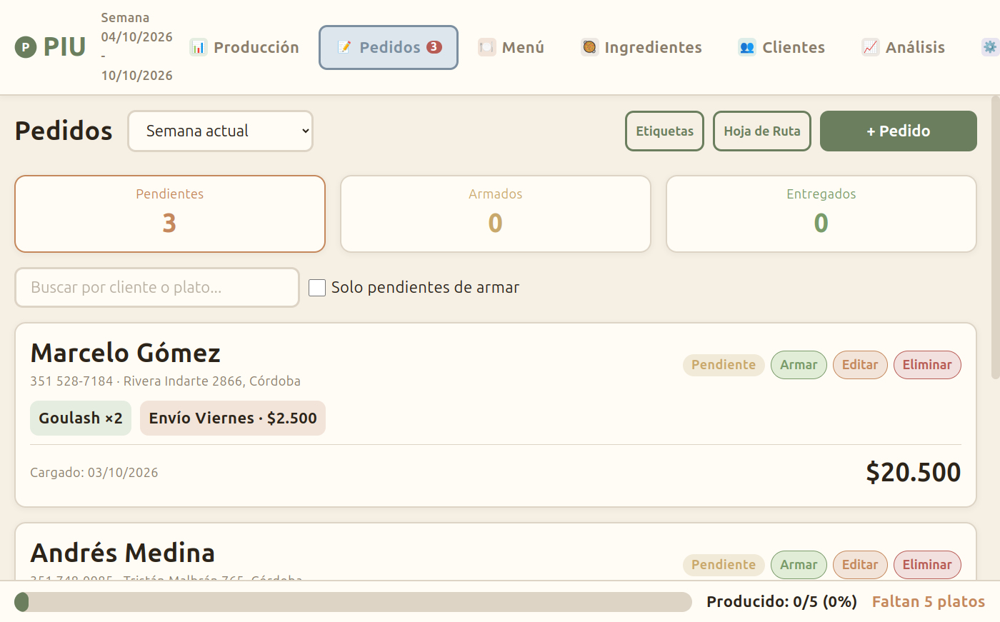
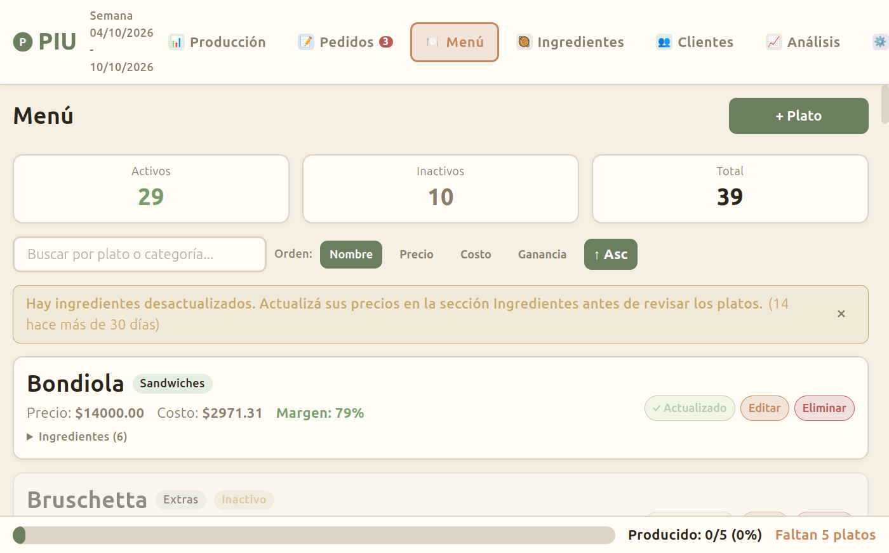
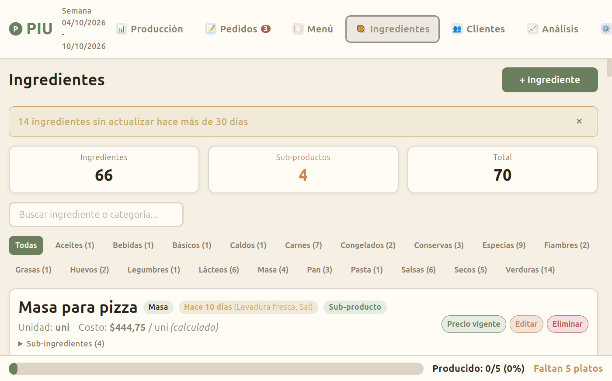

# Piu

Aplicación de escritorio para gestionar la producción semanal de una cocina comercial: pedidos de clientes, menú con costeo por receta, ingredientes, producción, hoja de ruta de envíos y análisis de rentabilidad.

Funciona offline, sin servidor: todos los datos viven en un archivo JSON local.



## Funcionalidades

- **Pedidos por semana** (domingo a sábado), con estados pendiente → armado → entregado, envío por día y etiquetas imprimibles.
- **Hoja de ruta**: geocodifica las direcciones, optimiza el orden de entrega por día con OSRM, muestra el recorrido en un mapa (Leaflet) y genera un PDF con un link de Google Maps por parada. También arma el mensaje de WhatsApp para el repartidor.
- **Producción**: cuánto hay que cocinar de cada plato según los pedidos, avance en tiempo real, lista de compras y hoja de producción en PDF.
- **Menú con costeo**: cada plato tiene su receta; el costo se calcula a partir de los ingredientes y sugiere precio según la ganancia deseada.
- **Ingredientes y sub-productos**: ingredientes compuestos (masa, salsas) con rendimiento por tanda, conversión de unidades y aviso de precios desactualizados.
- **Clientes**: historial de pedidos, detección de duplicados y verificación de la dirección en un mapa.
- **Análisis**: ingresos, costos, ganancia neta, margen y desperdicio por período; ranking de platos y clientes, tendencias y comparación entre períodos; exportación a Excel.
- **Backups automáticos** semanales en JSON y XLSX.
- Uso completo con teclado en los formularios (Enter, Esc, flechas).

## Capturas

| Producción | Pedidos |
|---|---|
|  |  |
| **Menú** | **Ingredientes** |
|  |  |

## Stack

- **Electron 33** + **React 18** + **Vite 6** + React Router 6
- Persistencia en un archivo JSON con escritura atómica (sin base de datos)
- jsPDF para PDFs, Leaflet + OpenStreetMap para mapas, Nominatim y OSRM para geocodificación y rutas, SheetJS para Excel
- Tests unitarios del store en Node y tests E2E con Playwright

## Arquitectura

```
electron/store.js   lógica de negocio y persistencia
electron/main.js    proceso principal, handlers IPC (piu:*)
electron/preload.js expone window.piu.* al renderer vía contextBridge
src/                interfaz React (páginas, componentes, utilidades)
```

El renderer nunca accede al disco: todo pasa por IPC hacia `store.js`.

## Desarrollo

```bash
npm install
node seed.js        # opcional: genera datos de ejemplo
npm run dev         # Vite + Electron
```

| Comando | Uso |
|---|---|
| `npm run dev` | Desarrollo con recarga en caliente |
| `npm run preview` | Compila y abre la app en modo producción |
| `npm run dist:win` | Genera el instalador para Windows |
| `npm run dist:linux` | Genera el paquete para Linux |
| `node test.js` | Tests unitarios del store |
| `node test-e2e/runner.js` | Tests E2E (requiere `npx vite` corriendo) |
